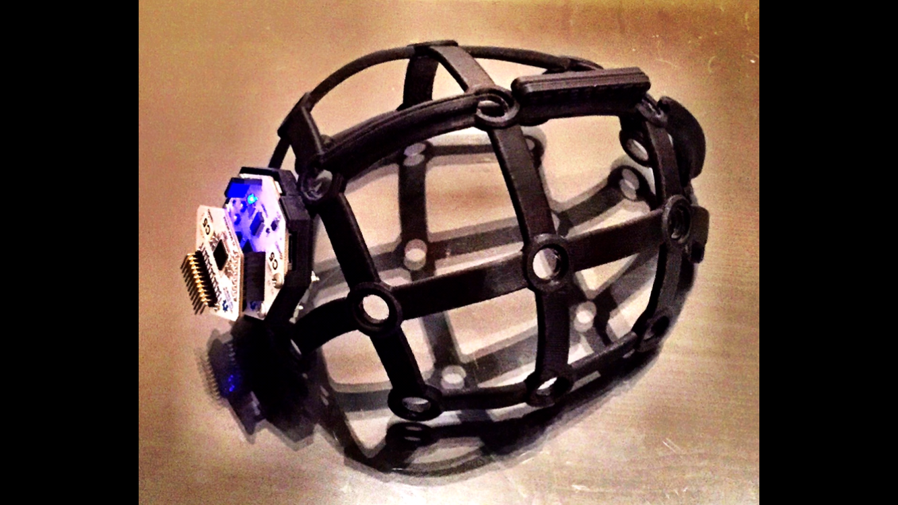
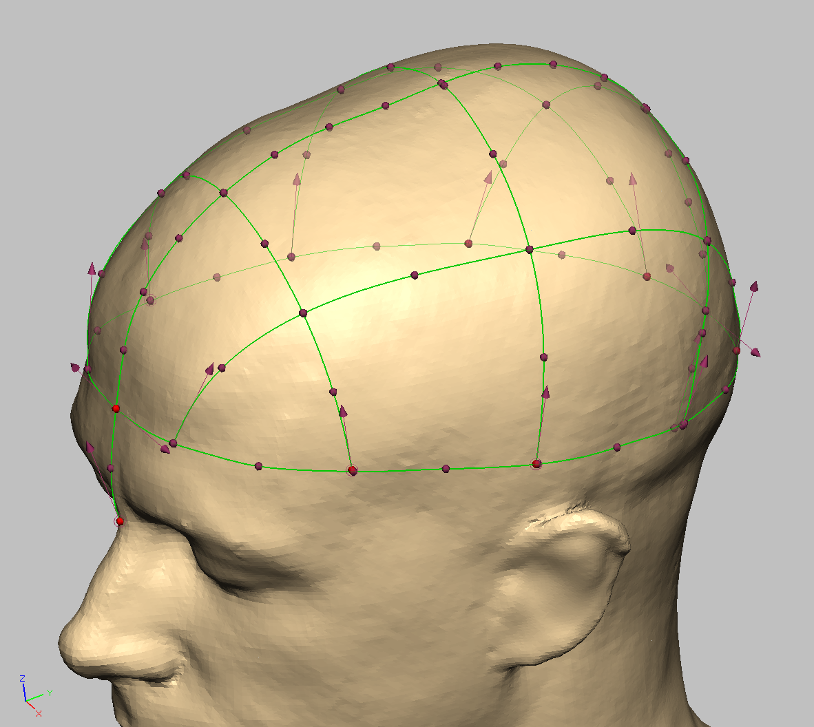
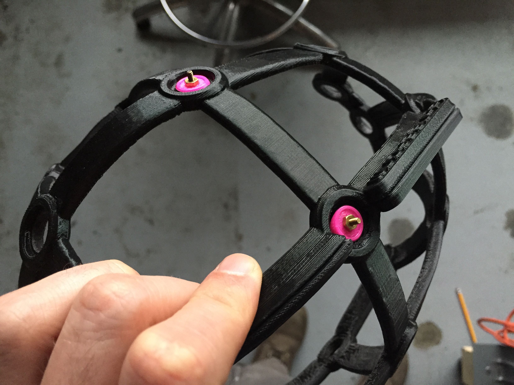
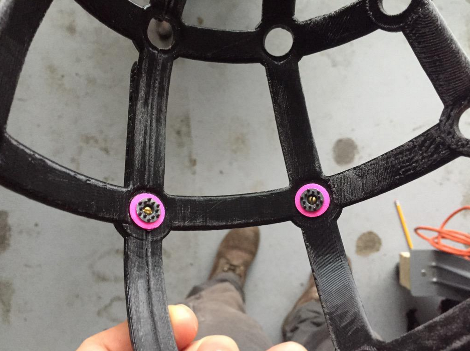
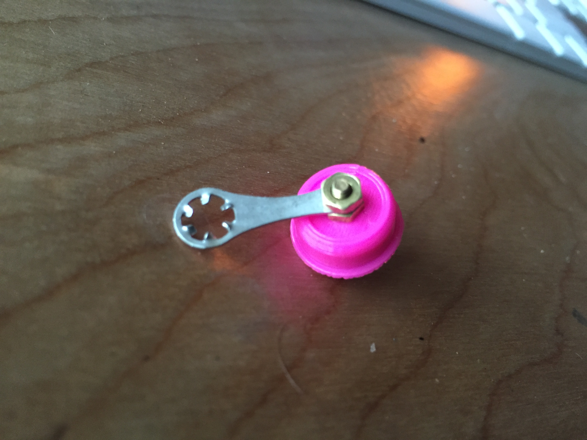

# ultracortex

**Note:** Mark 1 has been depricated by the newer model [Mark III REVISED](https://github.com/OpenBCI/Ultracortex/tree/master/Mark_III_Nova_REVISED)

Files related to the ultracortex, the 3D-printable EEG headset compatible with OpenBCI (currently under development).

The electrodes seen in the photos here are dry electrodes from Florida Research Instruments (FRI), found here: http://fri-fl-shop.com/product/package-of-15-disposable-reusable-dry-electrodes-and-10-disposablereusable-eeg-cup-electrodes-and-5-leads-red-white-green-black-brown/

The FRI_electrode_mount.stl was modeled to serve as a mechanical mount for the FRI electrodes.

The screws and nuts used to fasten the FRI electrode to the FRI_electrode_mount are:

- screws: [#2-56 Brass (1/2" length")](http://www.mcmaster.com/#91802a081/=xd3x3s) for variations in head style, see [here](http://www.mcmaster.com/#machine-screws/=xd3ycd)
- nuts:  [#2-56 Brass](https://www.boltdepot.com/Product-Details.aspx?product=7210)
- ground clip to fasten between the nuts and solder the electrode to: [Solder Lug](http://www.digikey.com/product-search/en/connectors-interconnects/terminals-solder-lug-connectors/1442863)

### Image References

