# Ultracortex (Mark 2)

**Note:** Mark 2 has been depricated by the newer model [Mark III REVISED](https://github.com/OpenBCI/Ultracortex/tree/master/Mark_III_Nova_REVISED)

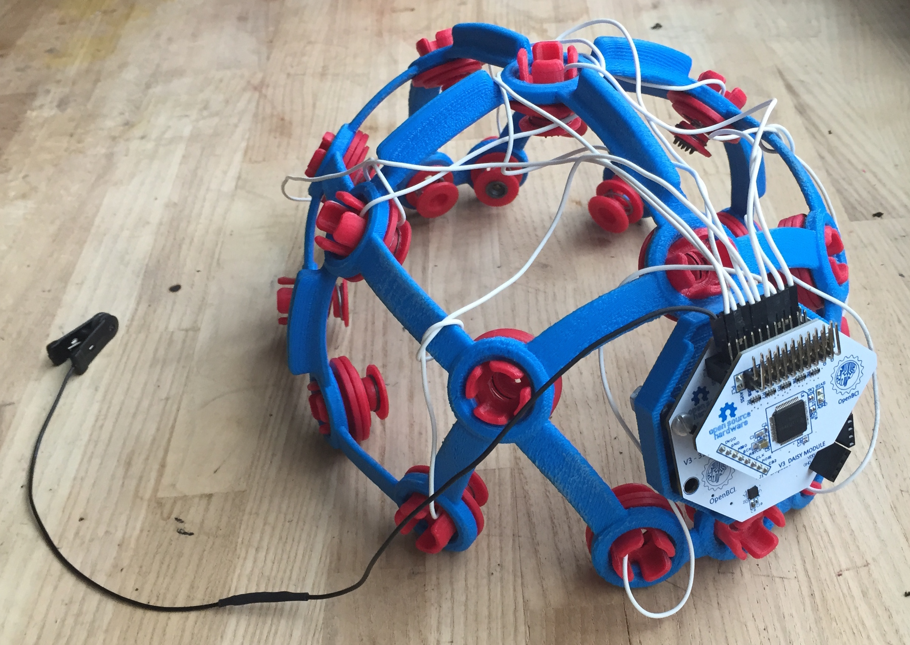

## Print Settings (verified)

* Printer used: Makerbot Rep 2
* Material: PLA

#### For M2-Frame Components

* Resolution: Low (Faster)
* Raft: Yes
* Supports: Yes (even though this uses A LOT of extra material)
* Infill: 100% (we want it sturdy)
* Number of shells: 3
* Layer Height: 0.3mm
* Temperature: 235 C
* Speed while Extruding: 45 mm/s (you may be able to increase this depending on how well tuned your 3D printer is)
* Speed while traveling: 150 mm/s

#### For M2-Electrode-Mount Components

* Resolution: Low (Faster)
* **Raft: No**
* **Supports: No**
* Infill: 100% (we want it sturdy)
* Number of shells: 3
* Layer Height: 0.3mm
* Temperature: 235 C
* Speed while Extruding: 45 mm/s (you may be able to increase this depending on how well tuned your 3D printer is)
* Speed while traveling: 150 mm/s

## Spring Options

We are in the process of testing different springs to be nested 

#### Spring 1 (tested)

[McMaster-Carr](http://www.mcmaster.com/#) > [1	9657K279	Steel Compression Spring, Zinc-Plated Music Wire, .500" L, .600" OD, .045" Wire, Packs of 12](http://www.mcmaster.com/#9657k279/=xkccgf)

**Summary**: The **~23 lb/in** is too strong!
 
#### Spring 2 (tested)

[centuryspring.com](http://centuryspring.com): Custom spring order of **Part # B6-8**

**Summary:** custom order... **~1 lb/in** is too weak...

#### Spring 3 & 4 (untested, but potentially better)

Our working version of the headset uses Springs 1 & 2, but I would recommend trying the following instead:

- [NN-92 - 2.4 lb/in](http://www.centuryspring.com/Store/item_detail.php?StockNumber=NN-92)
- [12685 - 3.9 lb/in](http://www.centuryspring.com/Store/item_detail.php?StockNumber=12685)

## Electrodes

Dry (spikey) electrodes to be installed in Ultracortex nodes with hair: 

* [Disposable / Reusable Dry EEG Electrode ($0.60 each at 50+ quantity purchase) ](http://fri-fl-shop.com/product/tde-200/)

Dry (non-spikey) electrodes to be installed in Ultracortex nodes without hair (forehead, for instance): 

* [Disposable / Reusable Cup Wet/Dry EEG Electrode ($10.00 for 15) ](http://fri-fl-shop.com/product/disposable-reusable-dry-eeg-electrode-quantity-of-15-tde-200a1/)

Ear Clip electrode (for reference)

* [TDI-430 Silver-Silver Chloride Ear Clip Electrode ($19.95 each)](http://fri-fl-shop.com/product/td-430-silver-disc-electrode-ear-clip/)

## Nuts & Bolts for Connecting Electrodes

We use small stainless steel screws and hex nuts to fasten the FRI electrodes (listed above) to the 3D-printed electrode mount components &  wiring that connects the electrodes back to the OpenBCI board. We used stripped [Electrode Starter Kit (ESK)](https://openbci.myshopify.com/collections/frontpage/products/openbci-electrode-starter-kit) electrodes as the cabling, by removing the gold cup with a wire cutter and looping the exposed wire around the screw between the two tightened hex nuts (as seen in the picture below).

* [Stainless Steel Pan Head Phillips Machine Screw, 2-56 Thread, 3/8" Length ($5.70 per pack of 50)](http://www.mcmaster.com/#91735a017/=xzahfj)
* [Stainless Steel Hex Nut, 2-56 Thread Size, 3/16" Wide, 1/16" High](http://www.mcmaster.com/#91841a003/=xzahv0)

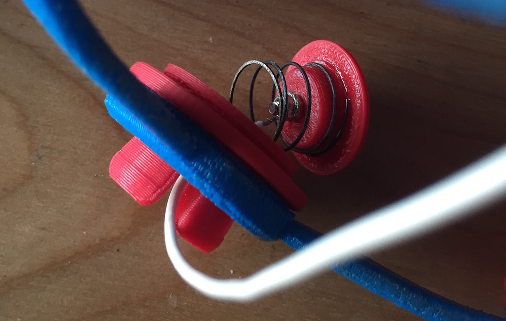

## Other Helpful Information

*  The following equipment/accessories were either necessary or very helpful in the assembly of this headset.
	* super glue
	* sandpaper
	* coarse flat & circular files
	* some sort of flexible wiring (terminating in a female header) to connect the electrodes back to the 
	* OpenBCI board. We used stripped [ESK](https://openbci.myshopify.com/collections/frontpage/products/	openbci-electrode-starter-kit) electrodes & stripped touch-proof connector cabling from the [OpenBCI Board Kit](https://openbci.myshopify.com/collections/frontpage/products/openbci-8-bit-board-kit).
	* an exacto/razor blade
	* wirecutters
	* needle-nose pliers
	
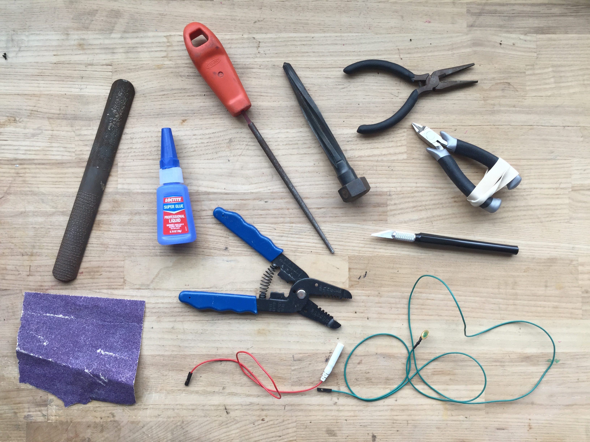
	
* The "M2_Electrode Mount A_01" part has a small lip on the inside (where the spring fits into) that must be manually removed with an exacto/razor blade. 
* Most of the tolerances between pieces are too tight, so assembly requires substantial filing and sanding.
* The "M2_Electrode Spacer_01" part is used to adjust for different head shapes and sizes
* With this versoin (M2) we unfortunately only have one frame size, so this headset will not fit most heads, even with the spacers and springs.
* Before printing, make sure to re-orient the frame STLs so the flat sides of the model are on the platform.

## Photos of Ultracortex M2

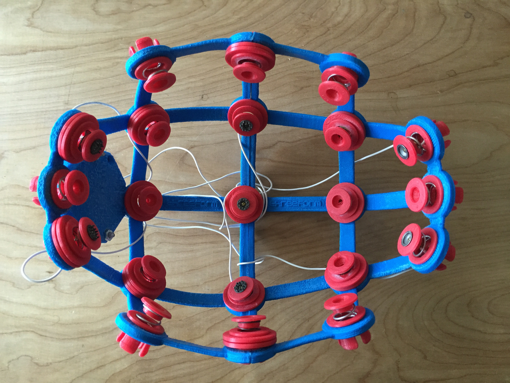
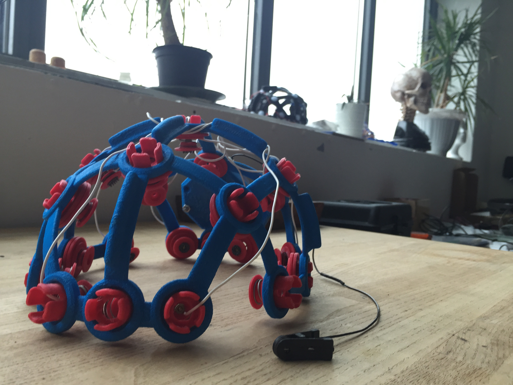
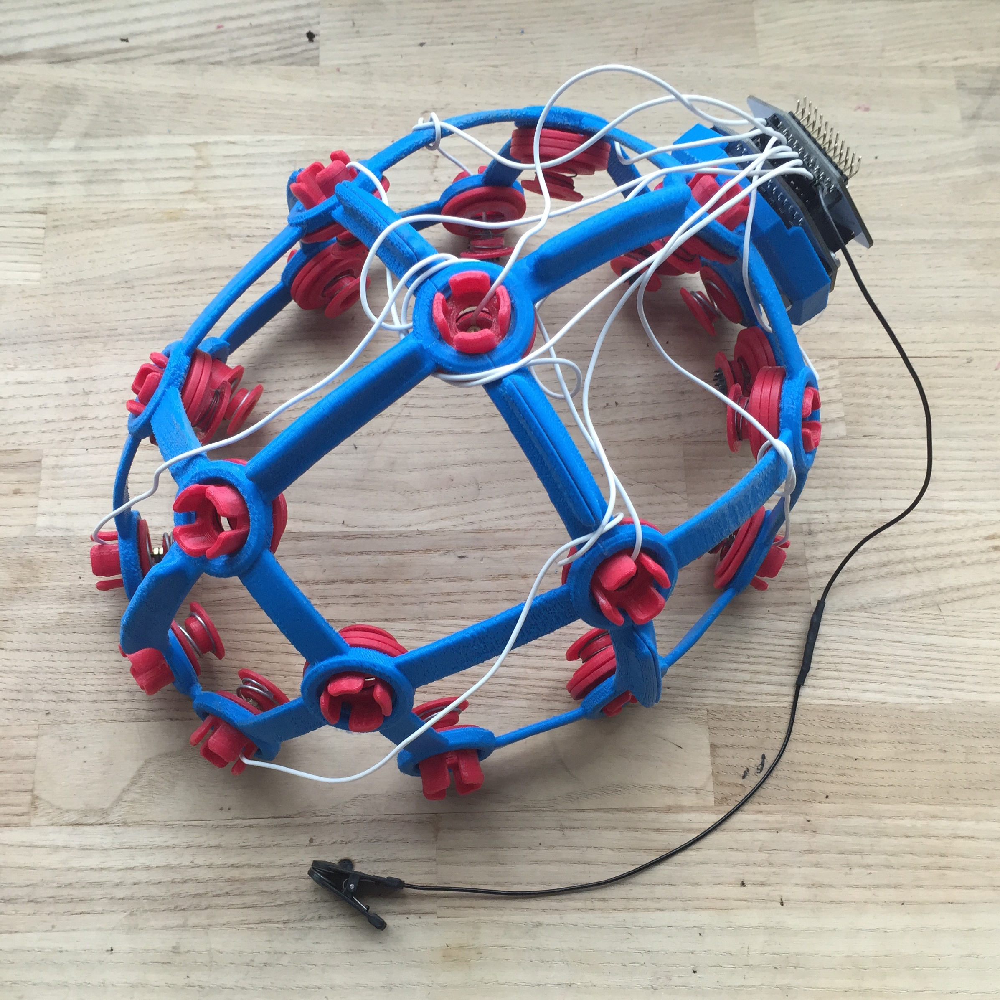
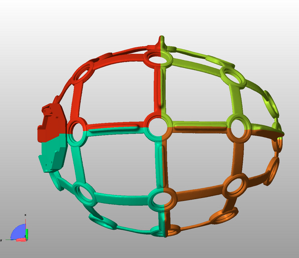
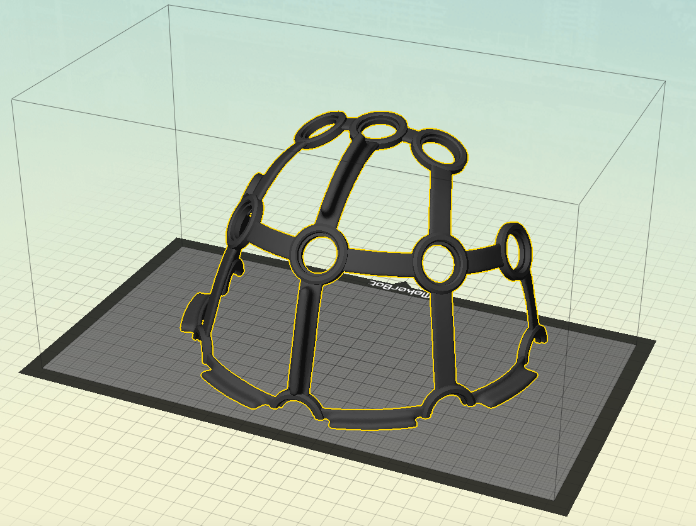
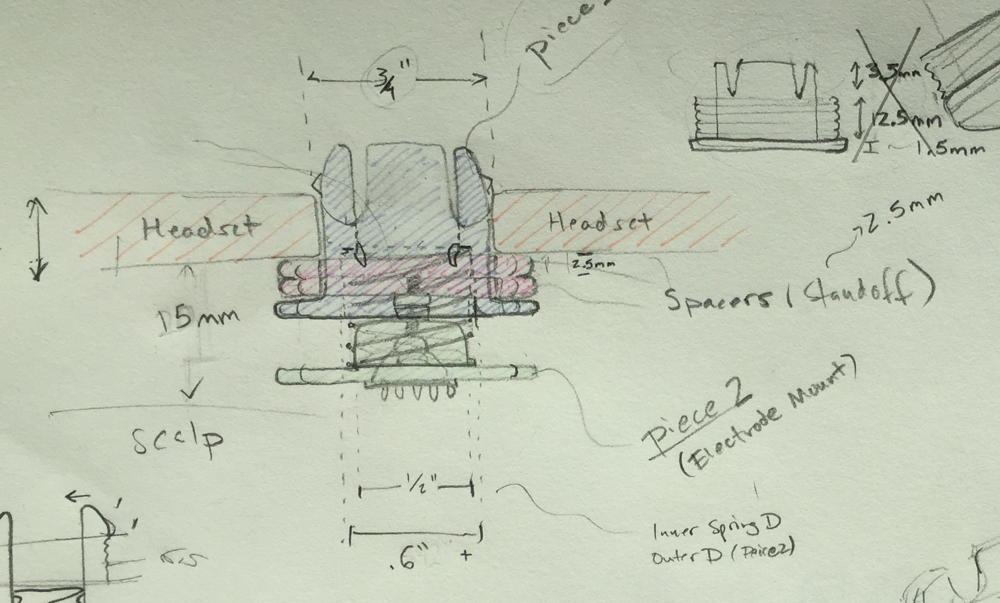

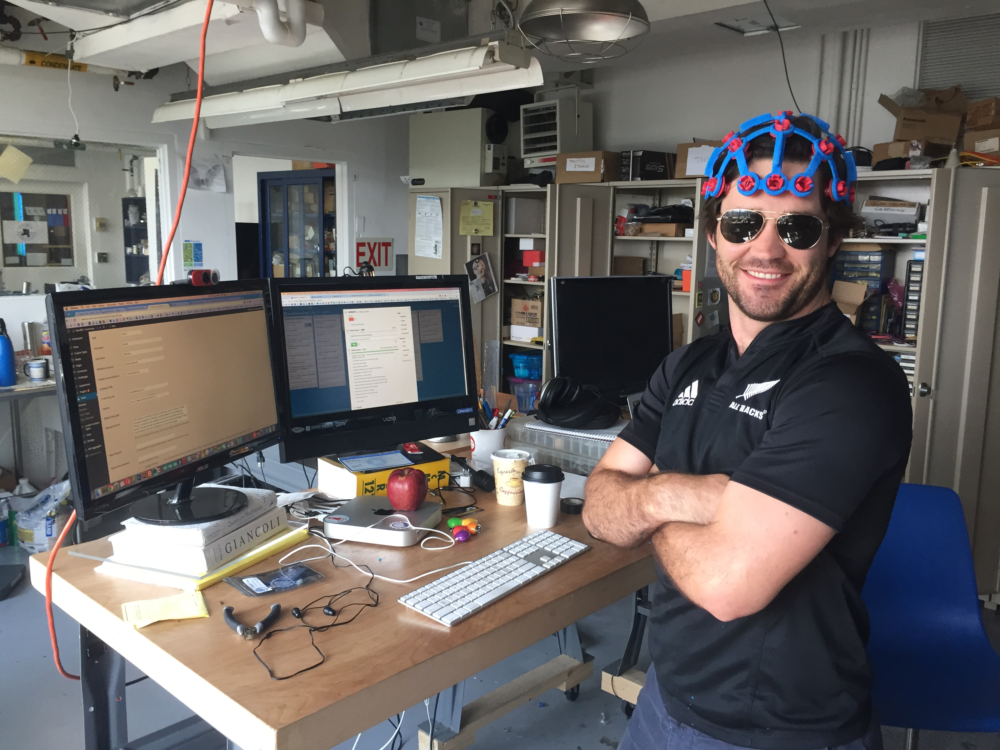
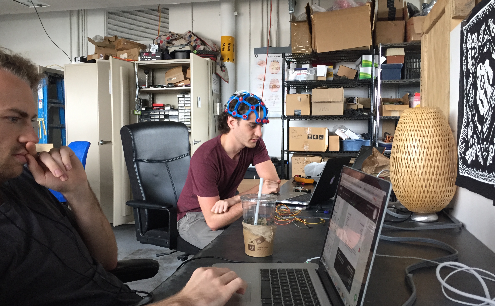
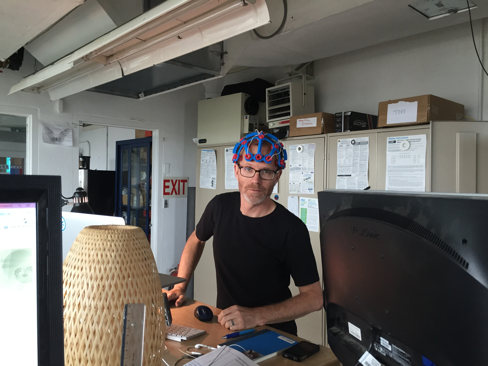

