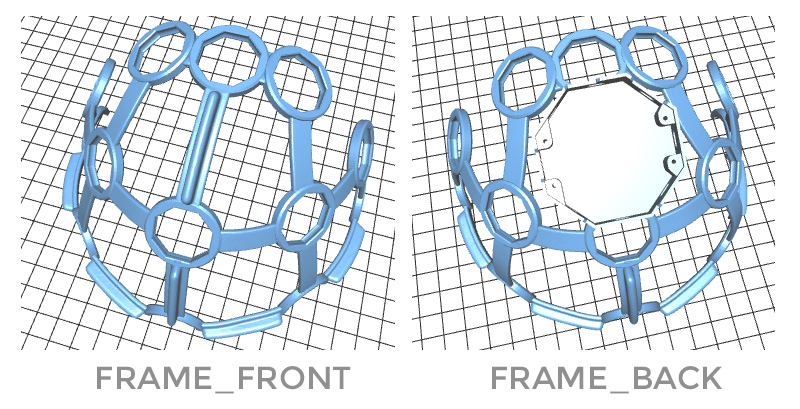
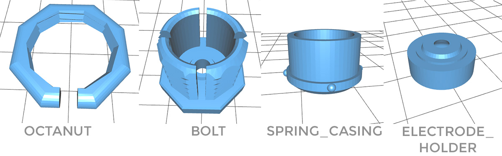
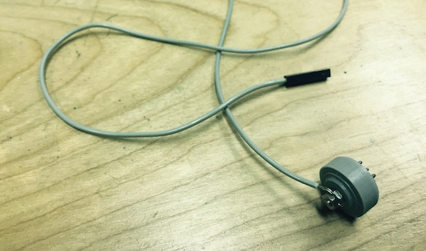

#Ultracortex Mark3
(July 2015-August 2015)

Designers & Engineers:

* [Aaron Trocolla (aka Threeform)](http://threeformfashion.com/)
* [Conor Russomanno](https://twitter.com/russomanno15)
* [Joel Murphy (aka SafeForRobots)](https://twitter.com/safeforrobots)

We want to give a big thank you to [3D SYSTEMS](http://www.3dsystems.com/) for their generous support in the Ultracortex Mark3 development process!

### THE COMPLETE HEADSET

Consists of:

* FRAME
	* [FRAME_FRONT](https://github.com/OpenBCI/Ultracortex/blob/master/Mark_3/LATEST_STLs/FRAME_FRONT.stl) (x1) — [.STL download link](https://github.com/OpenBCI/Ultracortex/raw/master/Mark_3/LATEST_STLs/FRAME_FRONT.stl)
	* [FRAME_BACK](https://github.com/OpenBCI/Ultracortex/blob/master/Mark_3/LATEST_STLs/FRAME_BACK.stl) (x1) — [.STL download link](https://github.com/OpenBCI/Ultracortex/raw/master/Mark_3/LATEST_STLs/FRAME_BACK.stl)
* MechParts
	* [OCTANUT](https://github.com/OpenBCI/Ultracortex/blob/master/Mark_3/LATEST_STLs/OCTANUT_MODIFIED_99innerThread.stl) (x21) — [.STL download link](https://github.com/OpenBCI/Ultracortex/raw/master/Mark_3/LATEST_STLs/OCTANUT_MODIFIED_99innerThread.stl)
	* [OCTABOLT](https://github.com/OpenBCI/Ultracortex/blob/master/Mark_3/LATEST_STLs/BOLT.stl) (x21) — [. STL download link](https://github.com/OpenBCI/Ultracortex/raw/master/Mark_3/LATEST_STLs/BOLT.stl)
	* [SPRING_CASING](https://github.com/OpenBCI/Ultracortex/blob/master/Mark_3/LATEST_STLs/SPRING_CASING_modified.stl) (x21) — [.STL download link](https://github.com/OpenBCI/Ultracortex/raw/master/Mark_3/LATEST_STLs/SPRING_CASING_modified.stl)
	* [ELECTRODE_HOLDER](https://github.com/OpenBCI/Ultracortex/blob/master/Mark_3/LATEST_STLs/ELECTRODE_HOLDER.stl) (x21) — [.STL download link](https://github.com/OpenBCI/Ultracortex/raw/master/Mark_3/LATEST_STLs/ELECTRODE_HOLDER.stl)
* Additional Hardware:
	* Suggested Spring listed below (x21)
	* Suggested Nut listed below (x42)
	* Suggested Bolt listed below (x21)
	* 1/4" #4 Machine Screw listed below (x4) for mounting the OpenBCI Board
* Wiring (ideally 21... 1 for each node) — we strip apart electrodes from the [Electrode Starter Kit](http://openbci.myshopify.com/collections/frontpage/products/openbci-electrode-starter-kit)) or from the Touch-Proof Connector cable that comes with an [OpenBCI Board Kit](http://openbci.myshopify.com/collections/frontpage/products/openbci-32-bit-board-kit)
* Electrodes by Florida Research Instruments
	* (18x) Dry (spikey) electrodes to be installed in Ultracortex nodes with hair: [Disposable / Reusable Dry EEG Electrode ($0.60 each at 50+ quantity purchase) ](http://fri-fl-shop.com/product/tde-200/)
	* (3x) Dry (non-spikey) electrodes to be installed in Ultracortex nodes without hair (forehead, for instance): [Disposable / Reusable Cup Wet/Dry EEG Electrode ($10.00 for 15) ](http://fri-fl-shop.com/product/disposable-reusable-dry-eeg-electrode-quantity-of-15-tde-200a1/)
	* (2x) Ear Clip electrode (for reference): [TDI-430 Silver-Silver Chloride Ear Clip Electrode ($19.95 each)](http://fri-fl-shop.com/product/td-430-silver-disc-electrode-ear-clip/)
* An [OpenBCI Bio-sensing Kit](http://openbci.myshopify.com/collections/frontpage/products/openbci-32-bit-board-kit)
* Lithium Ion Rechargeable Battery Pack (~500mAh) — [Sparkfun](https://www.sparkfun.com/products/10718) or [Adafruit](http://www.adafruit.com/products/1578)
* [A charger for your battery pack](https://www.adafruit.com/products/1304)

 
 

###Additional Hardware (Springs, Nuts, Bolts, & Screws)

#####Suggested Springs: 
* (21x) [Century Spring Corp. Stock #: U-4](http://www.centuryspring.com/Store/globalresults.php)

#####Suggested Nuts/Bolts:

We use small stainless steel screws and hex nuts to fasten the FRI electrodes (listed above) to the 3D-printed electrode mount components &  wiring that connects the electrodes back to the OpenBCI board. We used stripped [Electrode Starter Kit (ESK)](https://openbci.myshopify.com/collections/frontpage/products/openbci-electrode-starter-kit) electrodes as the cabling, by removing the gold cup with a wire cutter and looping the exposed wire around the screw between the two tightened hex nuts (as seen in the picture below).

* (21x) [Stainless Steel Pan Head Phillips Machine Screw, 2-56 Thread, 3/8" Length ($5.70 per pack of 50)](http://www.mcmaster.com/#91735a017/=xzahfj)
* (42x) [Stainless Steel Hex Nut, 2-56 Thread Size, 3/16" Wide, 1/16" High](http://www.mcmaster.com/#91841a003/=xzahv0)

#####Suggested Screws for OpenBCI Board Mounting

* (4x) [#4 Machine Screw](https://www.pololu.com/product/1960)

## PRINT SETTINGS

* FRAME_FRONT & FRAME_BACK
	* Material: PLA
	* Supports: YES
	* Raft: hopefully NO (but if supports aren't sticking, try the raft)
	* Infill: 20%
	* Layer Heigh: 0.2mm
	* Number of Shells: 2
	* Speed while extruding: 50%
* MechParts (OCTANUT // BOLT // SPRING_CASING // ELECTRODE_HOLDER)
	* Material: PLA
	* Supports: NO
	* Raft: NO
	* Infill: 30%
	* Layer Heigh: 0.2mm
	* Number of Shells: 2
	* Speed while extruding: 50%

## Necessary Assembly Tools:

* [Loctite Super Glue w/ Cyanoacrylate](http://www.amazon.com/Loctite-1365882-20-Gram-Bottle-Professional/dp/B004Y960MU/ref=sr_1_1?s=automotive&ie=UTF8&qid=1440204266&sr=1-1&keywords=loctite+cyanoacrylate&pebp=1440204267936&perid=0HJQ0FB9G4J9SEBQBVGA)
* coarse flat & circular files (for removing support artifacts)
* sand paper
* Exacto blade
* Philips head screw driver
* wire cutters
* needle-nose pliers

## Assembly Instructions:

(coming soon)

For questions about assembly, contact conor [at] openbci [dot] com

