#Ultracortex Mark 3
*Development Period: July 2015 — September 2015*

**Note:** Mark III has been depricated by the newer model [Mark III REVISED](https://github.com/OpenBCI/Ultracortex/tree/master/Mark_III_Nova_REVISED)

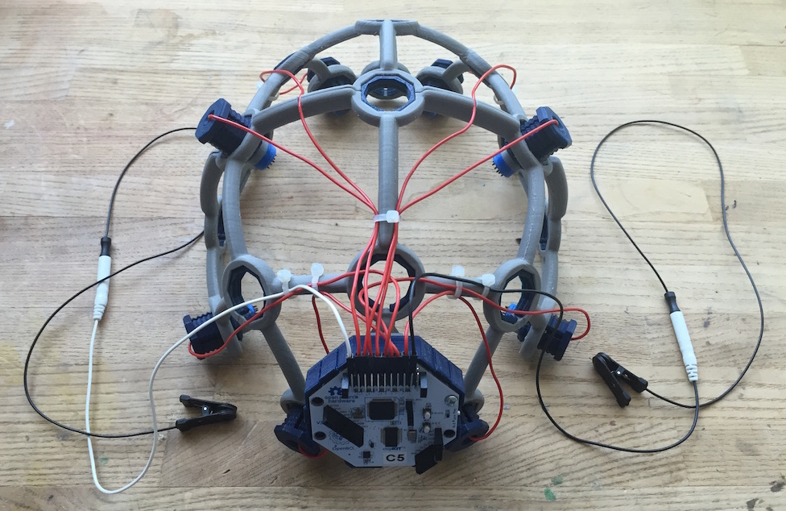

####Complete Ultracortex Mark 3 kits are [available for sale](http://openbci.myshopify.com/collections/frontpage/products/ultracortex-mark-3-eeg-headset-kit-assembly-required) in the OpenBCI Online Store!

The Ultracortex is an open-source, 3D-printable headset intended to work with the [OpenBCI system](http://openbci.com/). It is capable of recording research-grade brain activity (EEG), muscle activity (EMG), and heart activity (ECG). The Ultracortex is under constant iteration. If you print/assemble your own Ultracortex, we would love to hear your feedback. Send us an email at [contact@openbci.com](mailto:contact@openbci.com) or Tweet at us ([@Ultracortex](https://twitter.com/Ultracortex) & [@OpenBCI](https://twitter.com/OpenBCI))!

Designers & Engineers:

* [Aaron Trocola (aka Threeform)](http://threeformfashion.com/)
* [Conor Russomanno](https://twitter.com/russomanno15)
* [Joel Murphy (aka SafeForRobots)](https://twitter.com/safeforrobots)

## THE COMPLETE ULTRACORTEX

**Note:** the part quantities listed below assume you are making an electrode holder for all 21 nodes of the Ultracortex Mark 3. In reality, you will likely have only 8 or 16 electrodes, depending on whether you are working with the [OpenBCI 32bit Board](http://openbci.myshopify.com/collections/frontpage/products/openbci-32-bit-board-kit) (8 channels) or the [OpenBCI 16-channel R&D Kit](http://openbci.myshopify.com/collections/frontpage/products/openbci-16-channel-r-d-kit) (16 channels). You may only want to create as many electrode units as you have channels, and then add more as necessary. In general, more electrodes will distribute the downward scalp pressure, increasing comfort.

###3D-printed Parts:

* [FRAME](https://github.com/OpenBCI/Ultracortex/tree/master/Mark_3/STLs/FRAME) (head circumference: small = 50-55cm, medium = 55-60cm, large = 60-65cm)
	* FRAME_FRONT (**x1**) — .STLs ([small](https://github.com/OpenBCI/Ultracortex/raw/master/Mark_3/STLs/FRAME/small/FRONT_small.stl) / [medium](https://github.com/OpenBCI/Ultracortex/raw/master/Mark_3/STLs/FRAME/medium/FRONT_medium.stl) / [large](https://github.com/OpenBCI/Ultracortex/raw/master/Mark_3/STLs/FRAME/large/FRONT_large.stl))
	* FRAME_BACK (**x1**) — .STLs ([small](https://github.com/OpenBCI/Ultracortex/raw/master/Mark_3/STLs/FRAME/small/BACK_small.stl) / [medium](https://github.com/OpenBCI/Ultracortex/raw/master/Mark_3/STLs/FRAME/medium/BACK_medium.stl) / [large](https://github.com/OpenBCI/Ultracortex/raw/master/Mark_3/STLs/FRAME/large/BACK_large.stl))
* [MECH_PARTS](https://github.com/OpenBCI/Ultracortex/tree/master/Mark_3/STLs/MECH_PARTS)
	* [OCTANUT](https://github.com/OpenBCI/Ultracortex/blob/master/Mark_3/STLs/MECH_PARTS/OCTANUT.stl) (**x21**) — [.STL download link](https://github.com/OpenBCI/Ultracortex/raw/master/Mark_3/STLs/MECH_PARTS/OCTANUT.stl)
	* [OCTABOLT](https://github.com/OpenBCI/Ultracortex/blob/master/Mark_3/STLs/MECH_PARTS/OCTABOLT.stl) (**x21**) — [.STL download link](https://github.com/OpenBCI/Ultracortex/raw/master/Mark_3/STLs/MECH_PARTS/OCTABOLT.stl)
	* [SPRING_CASING](https://github.com/OpenBCI/Ultracortex/blob/master/Mark_3/STLs/MECH_PARTS/SPRING_CASING.stl) (**x21**) — [.STL download link](https://github.com/OpenBCI/Ultracortex/raw/master/Mark_3/STLs/MECH_PARTS/SPRING_CASING.stl)
	* [ELECTRODE_HOLDER](https://github.com/OpenBCI/Ultracortex/blob/master/Mark_3/STLs/MECH_PARTS/ELECTRODE_HOLDER.stl) (**x21**) — [.STL download link](https://github.com/OpenBCI/Ultracortex/raw/master/Mark_3/STLs/MECH_PARTS/ELECTRODE_HOLDER.stl)
* [BOARD_HOLDER](https://github.com/OpenBCI/Ultracortex/blob/master/Mark_3/STLs/BOARD_HOLDER.stl) (**x1**) — [.STL download link](https://github.com/OpenBCI/Ultracortex/raw/master/Mark_3/STLs/HOLDER_AND_COVER/BOARD_HOLDER.stl)
* BOARD_COVER (**x1**) — choose STANDARD or ADVANCED
	* [STANDARD](https://github.com/OpenBCI/Ultracortex/blob/master/Mark_3/STLs/BOARD_COVER_logo.stl) — [.STL download link](https://github.com/OpenBCI/Ultracortex/raw/master/Mark_3/STLs/HOLDER_AND_COVER/BOARD_COVER_STANDARD.stl)
	* [ADVANCED](https://github.com/OpenBCI/Ultracortex/blob/master/Mark_3/STLs/BOARD_COVER_advancedVersion.stl) (for extra hardware accessibility / if you've soldered on your header rows) — [.STL download link](https://github.com/OpenBCI/Ultracortex/raw/master/Mark_3/STLs/HOLDER_AND_COVER/BOARD_COVER_ADVANCED.stl)

###Non-printed Parts:
 	
* Additional Hardware:
	* **Suggested Spring 1** listed below (**x21**)
	* **Suggested Spring 2** listed below (**x5**)
	* **Suggested Nuts** listed below (**x42**)
	* **Suggested Bolts** listed below (**x21**)
	* 1/4" #4 Drive Screw listed below (**x8**) for mounting the BOARD_HOLDER and OpenBCI Board
* Wiring (**x21**)
	* We strip apart the [Gold Cup Electrodes](http://openbci.myshopify.com/collections/frontpage/products/openbci-gold-cup-electrodes) or from the Touch-Proof Connector cable that comes with an [OpenBCI 32bit Board Kit](http://openbci.myshopify.com/collections/frontpage/products/openbci-32-bit-board-kit).
* Dry electrodes by Florida Research Instruments
	* (**18x**) Dry (spikey) electrodes to be installed in Ultracortex nodes with hair: [Disposable / Reusable Dry EEG Electrode ($0.60 each at 50+ quantity purchase) ](http://fri-fl-shop.com/product/tde-200/)
	* (**3x**) Dry (non-spikey) electrodes to be installed in Ultracortex nodes without hair (forehead, for instance): [Disposable / Reusable Cup Wet/Dry EEG Electrode ($10.00 for 15) ](http://fri-fl-shop.com/product/disposable-reusable-dry-eeg-electrode-quantity-of-15-tde-200a1/)
	* (**2x**) Ear Clip electrode (for reference): [TDI-430 Silver-Silver Chloride Ear Clip Electrode ($19.95 each)](http://fri-fl-shop.com/product/td-430-silver-disc-electrode-ear-clip/)
* (**1x**) An [OpenBCI 32bit Board](http://openbci.myshopify.com/collections/frontpage/products/openbci-32-bit-board-kit) or an [OpenBCI 16-channel R&D Kit](http://openbci.myshopify.com/collections/frontpage/products/openbci-16-channel-r-d-kit)
* (**1x**) Lithium Ion Rechargeable Battery Pack (~500mAh) — [Sparkfun](https://www.sparkfun.com/products/10718) or [Adafruit](http://www.adafruit.com/products/1578)
* (**1x**) [A charger for your battery pack](https://www.adafruit.com/products/1304)
* (**~10x**) [Zip tie](http://www.amazon.com/Black-Zip-Tie-100-Bag/dp/B0001IMMJI)

## THE COMPLETE ULTRACORTEX (w/ PICTURES)

###3D-printed Parts:

####(1x) FRAME

* [FRAME](https://github.com/OpenBCI/Ultracortex/tree/master/Mark_3/STLs/FRAME) (head circumference: small = 50-55cm, medium = 55-60cm, large = 60-65cm)
	* FRAME_FRONT (**x1**) — .STLs ([small](https://github.com/OpenBCI/Ultracortex/raw/master/Mark_3/STLs/FRAME/small/FRONT_small.stl) / [medium](https://github.com/OpenBCI/Ultracortex/raw/master/Mark_3/STLs/FRAME/medium/FRONT_medium.stl) / [large](https://github.com/OpenBCI/Ultracortex/raw/master/Mark_3/STLs/FRAME/large/FRONT_large.stl))
	* FRAME_BACK (**x1**) — .STLs ([small](https://github.com/OpenBCI/Ultracortex/raw/master/Mark_3/STLs/FRAME/small/BACK_small.stl) / [medium](https://github.com/OpenBCI/Ultracortex/raw/master/Mark_3/STLs/FRAME/medium/BACK_medium.stl) / [large](https://github.com/OpenBCI/Ultracortex/raw/master/Mark_3/STLs/FRAME/large/BACK_large.stl))

 

####(21x) MECH_PARTS

* [MECH_PARTS](https://github.com/OpenBCI/Ultracortex/tree/master/Mark_3/STLs/MECH_PARTS)
	* [OCTANUT](https://github.com/OpenBCI/Ultracortex/blob/master/Mark_3/STLs/MECH_PARTS/OCTANUT.stl) (**x21**) — [.STL download link](https://github.com/OpenBCI/Ultracortex/raw/master/Mark_3/STLs/MECH_PARTS/OCTANUT.stl)
	* [OCTABOLT](https://github.com/OpenBCI/Ultracortex/blob/master/Mark_3/STLs/MECH_PARTS/OCTABOLT.stl) (**x21**) — [.STL download link](https://github.com/OpenBCI/Ultracortex/raw/master/Mark_3/STLs/MECH_PARTS/OCTABOLT.stl)
	* [SPRING_CASING](https://github.com/OpenBCI/Ultracortex/blob/master/Mark_3/STLs/MECH_PARTS/SPRING_CASING.stl) (**x21**) — [.STL download link](https://github.com/OpenBCI/Ultracortex/raw/master/Mark_3/STLs/MECH_PARTS/SPRING_CASING.stl)
	* [ELECTRODE_HOLDER](https://github.com/OpenBCI/Ultracortex/blob/master/Mark_3/STLs/MECH_PARTS/ELECTRODE_HOLDER.stl) (**x21**) — [.STL download link](https://github.com/OpenBCI/Ultracortex/raw/master/Mark_3/STLs/MECH_PARTS/ELECTRODE_HOLDER.stl)

 

####(1x) BOARD_HOLDER

* [BOARD_HOLDER](https://github.com/OpenBCI/Ultracortex/blob/master/Mark_3/STLs/BOARD_HOLDER.stl) (**x1**) — [.STL download link](https://github.com/OpenBCI/Ultracortex/raw/master/Mark_3/STLs/BOARD_HOLDER.stl)

 

####(1x) BOARD_COVER

* BOARD_COVER (**x1**) — choose STANDARD or ADVANCED
	* [STANDARD](https://github.com/OpenBCI/Ultracortex/blob/master/Mark_3/STLs/BOARD_COVER_logo.stl) — [.STL download link](https://github.com/OpenBCI/Ultracortex/raw/master/Mark_3/STLs/BOARD_COVER_logo.stl)
	* [ADVANCED](https://github.com/OpenBCI/Ultracortex/blob/master/Mark_3/STLs/BOARD_COVER_advancedVersion.stl) (for extra hardware accessibility / if you've soldered on your header rows) — [.STL download link](https://github.com/OpenBCI/Ultracortex/raw/master/Mark_3/STLs/BOARD_COVER_advancedVersion.stl)

 

###Non-printed Parts:

####Suggested springs: 

* Suggested Spring 1 (**x21**) — aka "Weak Spring" — [Century Spring Corp. Stock #: U-4](http://cad.centuryspring.com/db/service?domain=century&command=showProduct&category=compression&product=U-4) — this spring is not as strong as spring 2. We use it to mount the electrodes. The low "Rate" (1.3 lbs/in) makes it more forgiving and comfortable when holding the spikey electrode against your head. This process is described in more detail below (in the "Assembly Instructions" section).

* Suggested Spring 2 (**x5**) — aka "Strong Spring" — [Century Spring Corp. Stock #: S-845](http://cad.centuryspring.com/db/service?domain=century&command=showProduct&category=compression&product=S-845) — this spring has a much stronger "Rate" (14 lb/in). This makes is ideal to act as a standoff at locations where you do not have a spikey electrode. This process is described in more detail below (in the "Assembly Instructions" section).

####Suggested nuts/bolts:

We use small stainless steel screws and hex nuts to fasten the FRI electrodes (listed above) to the 3D-printed electrode mount components &  wiring that connects the electrodes back to the OpenBCI board. We used stripped [Gold Cup Electrodes](http://openbci.myshopify.com/collections/frontpage/products/openbci-gold-cup-electrodes) as the cabling, by removing the gold cup with a wire cutter and looping the exposed wire around the screw between the two tightened hex nuts (as seen in the picture below).

* (**21x**) [Stainless Steel Pan Head Phillips Machine Screw, 2-56 Thread, 3/8" Length ($5.70 per pack of 50)](http://www.mcmaster.com/#91735a017/=xzahfj)
* (**42x**) [Stainless Steel Hex Nut, 2-56 Thread Size, 3/16" Wide, 1/16" High](http://www.mcmaster.com/#91841a003/=xzahv0)

####Suggested screws for fastening BOARD_MOUNT & OpenBCI Board

* (**8x**) [#4 Drive Screw](http://www.mcmaster.com/#90077a106/=yysd5f)

####Wiring

* (**21x**) We strip apart the [Gold Cup Electrodes](http://openbci.myshopify.com/collections/frontpage/products/openbci-gold-cup-electrodes)) or the Touch-Proof Connector cable that comes with an [OpenBCI 32bit Board Kit](http://openbci.myshopify.com/collections/frontpage/products/openbci-32-bit-board-kit).

####Dry electrodes by Florida Research Instruments

* (**18x**) Dry (spikey) electrodes to be installed in Ultracortex nodes with hair: [Disposable / Reusable Dry EEG Electrode ($0.60 each at 50+ quantity purchase) ](http://fri-fl-shop.com/product/tde-200/)
* (**3x**) Dry (non-spikey) electrodes to be installed in Ultracortex nodes without hair (forehead, for instance): [Disposable / Reusable Cup Wet/Dry EEG Electrode ($10.00 for 15) ](http://fri-fl-shop.com/product/disposable-reusable-dry-eeg-electrode-quantity-of-15-tde-200a1/)
* (**2x**) Ear Clip electrode (for reference): [TDI-430 Silver-Silver Chloride Ear Clip Electrode ($19.95 each)](http://fri-fl-shop.com/product/td-430-silver-disc-electrode-ear-clip/)

####(1x) An [OpenBCI 32bit Board](http://openbci.myshopify.com/collections/frontpage/products/openbci-32-bit-board-kit) (8 electrode channels) or an [OpenBCI 16-channel R&D Kit](http://openbci.myshopify.com/collections/frontpage/products/openbci-16-channel-r-d-kit) (16 electrode channels)

####(**1x**) ~500mAh lithium ion rechargeable battery pack ([Sparkfun](https://www.sparkfun.com/products/10718) or [Adafruit](http://www.adafruit.com/products/1578)) & (**1x**) [A charger for your battery pack](https://www.adafruit.com/products/1304)

#### (**~10x**) [Zip tie](http://www.amazon.com/Black-Zip-Tie-100-Bag/dp/B0001IMMJI)

## SUGGESTED PRINT SETTINGS

* FRAME_FRONT & FRAME_BACK
	* Material: PLA
	* Supports: YES
	* Raft: hopefully NO (but if supports aren't sticking, try the raft)
	* Infill: 20%
	* Layer Height: 0.2mm
	* Number of Shells: 3
	* Speed while extruding: 50-70% (slow it down if possible; these parts are detailed)
* MECH_PARTS (OCTANUT / BOLT / SPRING_CASING / ELECTRODE_HOLDER)
	* Material: PLA
	* Supports: NO
	* Raft: NO
	* Infill: 20%
	* Layer Height: 0.2mm
	* Number of Shells: 3
	* Speed while extruding: 50-70% (slow it down if possible; these parts are detailed)
* BOARD_MOUNT, BOARD_COVER_STANDARD, & BOARD_COVER_ADVANCED
	* Material: PLA
	* Supports: NO
	* Raft: NO
	* Infill: 20%
	* Layer Height: 0.2mm
	* Number of Shells: 3
	* Speed while extruding: 50-70% (slow it down if possible; these parts are detailed)

## RECOMMENDED ASSEMBLY TOOLS

1. [Loctite Super Glue w/ Cyanoacrylate](http://www.amazon.com/Loctite-1365882-20-Gram-Bottle-Professional/dp/B004Y960MU/ref=sr_1_1?s=automotive&ie=UTF8&qid=1440204266&sr=1-1&keywords=loctite+cyanoacrylate&pebp=1440204267936&perid=0HJQ0FB9G4J9SEBQBVGA)
2. coarse flat & circular files (for removing support artifacts)
3. medium sand paper
4. exacto blade
5. philips head screw driver
6. wire cutters
7. needle-nose pliers
8. snippers

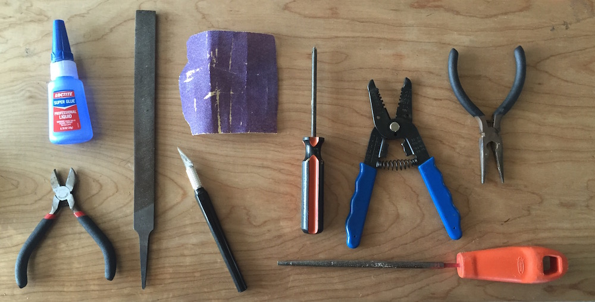

## ASSEMBLY INSTRUCTIONS

### Remove residual support material & print flaws

Use sand paper, a file, and snippers to clean your FRAME and other 3D-printed parts. The most important part of this process is that you thoroughly clean out the frames nodes where you will place your OCTANUT pieces.

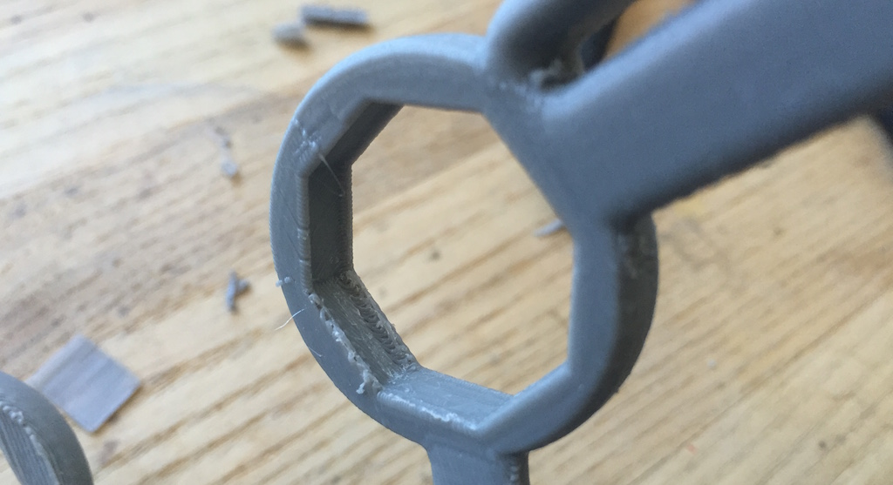

### Glue the FRAME together

Carefully, glue the FRAME_FRONT and FRAME_BACK together with your Cyanoacrylate super glue. The best way to do this is to place both halves of the frame on a level surface and carefully bring them together. Be sure to be precise; it's VERY difficult to pull the pieces apart once you've put them together.

### Mount the OpenBCI BOARD_HOLDER

Use four #4 Drive Screws to mount the BOARD_HOLDER to the FRAME. Make sure that the orientation of the BOARD_HOLDER matches that of the pictures below:

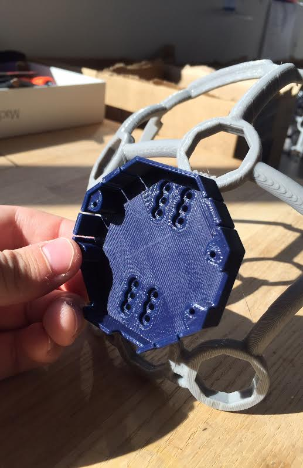
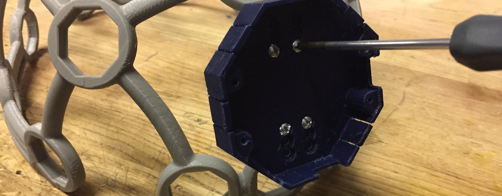

### Insert OCTANUT pieces (x21) into frame

**Note:** at each node, you must line up the cut in the OCTANUT with the indentation on the frame as indicated in the picture below.

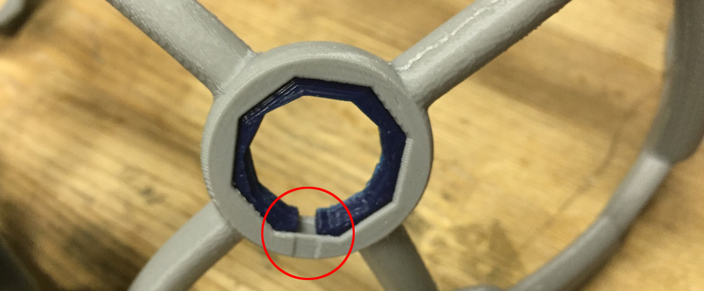

Your Ultracortex should now look like this:

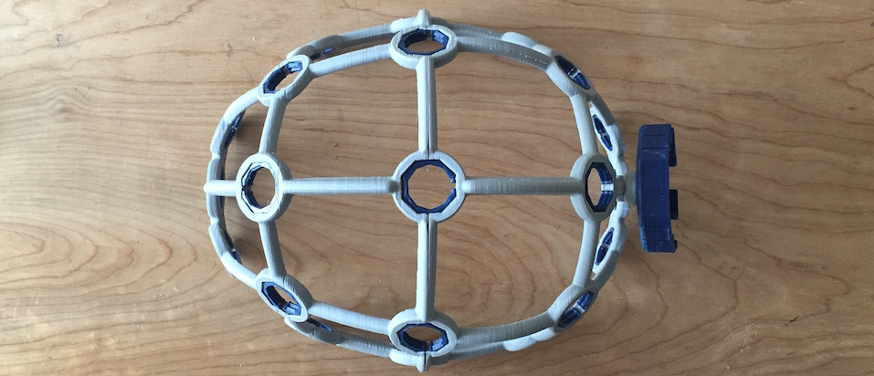

### Embed OpenBCI into the Ultracortex

Connect your ~500 mAh lithium ion rechargeable batter to the back of your 32bit OpenBCI Board. Then fold the battery and its wires neatly behind the board before inserting the board into the BOARD_MOUNT. You can then use one of your #4 Drive Screws to secure the OpenBCI Board to the BOARD_MOUNT. Typically you don't need to use any #4 Drive Screws because the BOARD_COVER locks the OpenBCI Board in place, but in this case it's a good idea because you'll want to see where you're connecting your wires.

### Identify electrode locations

Before creating your electrode mounts, it's a good idea to think about where you may want to place the electrodes on the Ultracortex FRAME. The placement of the electrode may affect how long you make the wire between the electrode and where the OpenBCI is mounted, at the back of the frame.

The Ultracortex node locations are based on the [10-20 system](https://goo.gl/gSwYw), which is the internationally accepted standard for electrode placement in the context of EEG.

The images below indicates the default 10-20 electrode locations that the OpenBCI Graphical User Interface expects. This application is great for viewing/recording your EEG and can be found in our [OpenBCI_Processing](http://) repo. The blue nodes indicate the 8 default 10-20 locations (channels 1-8) of the 32bit Board. The red nodes indicate the default 10-20 locations of channels 9-16 when using the OpenBCI 16-channel R&D Kit. 

For the remainder of this tutorial, the blue nodes on the 10-20 system diagram (channels 1-8 of the OpenBCI default settings) will be used. The channel to 10-20 system correlations are as follows:

* Channel 1 - Fp1
* Channel 2 - Fp2
* Channel 3 - C3
* Channel 4 - C4
* Channel 5 - P7
* Channel 6 - P8
* Channel 7 - O1
* Channel 8 - O2

### Connect wiring to OpenBCI

Before shortening any of your wires, connect the female header of each wire to the N pin of channels 1-8, as indicated in the image to the lower right. The N pins are the ones closer to the OpenBCI Board. By default, the OpenBCI Board references these 8 pins with the SRB 2 pin (the bottom SRB pin).

### Measure, cut, and strip wires

For each wire, measure the distance between where it is connected to the OpenBCI Board and the node that it will terminate at on the Ultracortex frame. Give yourself 2-3 inches of slack (extra length), because you're going to strip the end of the wire, and you may want the extra slack to zip-tie/tape the wiring to the frame later on.

As mentioned above, if you're using the default OpenBCI electrode configuration, cut the wires so that they terminate at the following nodes:

* Channel 1 - Fp1
* Channel 2 - Fp2
* Channel 3 - C3
* Channel 4 - C4
* Channel 5 - P7
* Channel 6 - P8
* Channel 7 - O1
* Channel 8 - O2

After you're done measuring, cutting, and stripping your wires, disconnect them from the OpenBCI board. You will need the female header free so you can guide the springs and OCTANUT pieces into place in the following step. But remember which wire goes where!

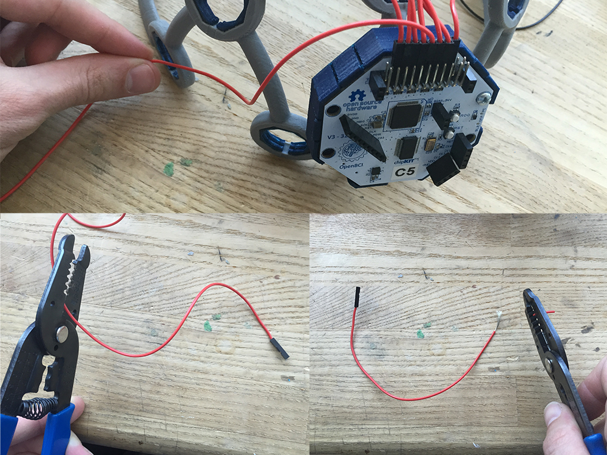

### Assemble electrode mounts (x8 or x16)
**Note:** repeat the following steps as many times as necessary, depending upon your OpenBCI setup. In general, using more electrodes will distribute the downward scalp pressure, increasing comfort. Additionally, to increase comfort you can create electrode units without electrodes and the wires to place at various nodes around the frame. This will also help to distribute  pressure.

These are the pieces that comprise one full electrode unit:
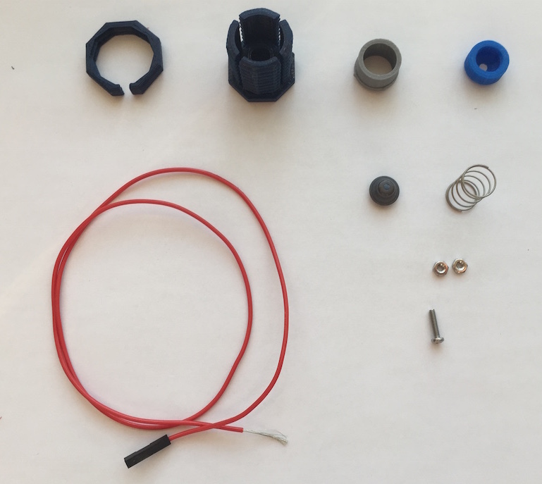

First, slide a **Machine Screw (2-56 Thread, 3/8" Length)** through the FRI electrode and guide it into the ELECTRODE_HOLDER.
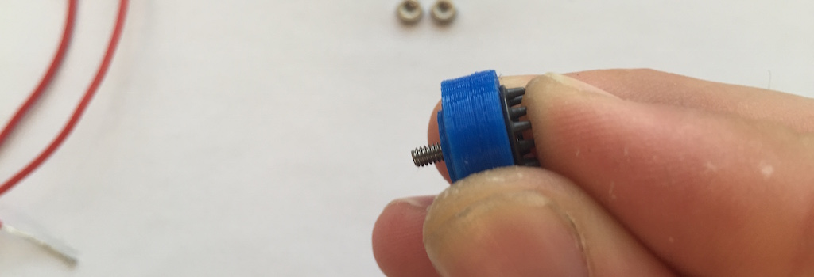

Then, twist your first **Hex Nut (2-56 Thread Size, 3/16" Wide, 1/16" High)** onto the screw, securing the electrode to the holder.
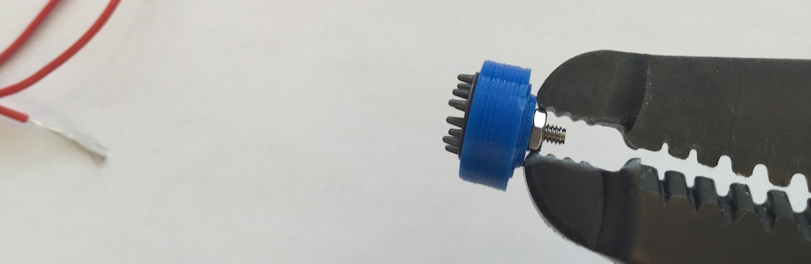

Next, twist the exposed metal of your wire so that it is tight and clean.

This part is a little bit tricky! Wrap the exposed metal of your wire around the remaining thread of the screw. You can use your finger nail to pinch the wire down against the nut, while wrapping.
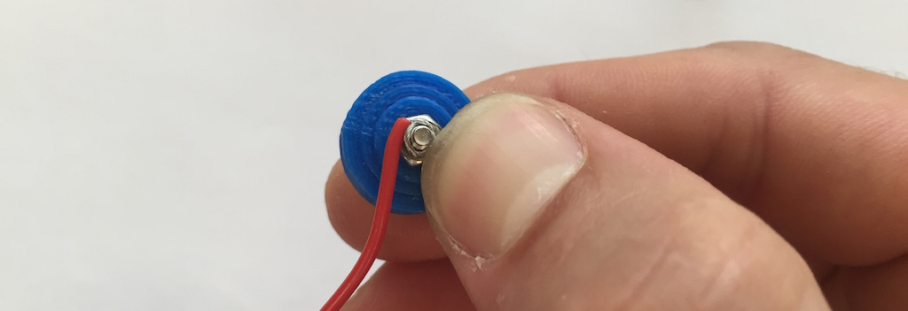

Then, twist your second Hex Nut onto the screw, securing the wire between the two nuts. You can use wire cutters to firmly screw the nut into place.
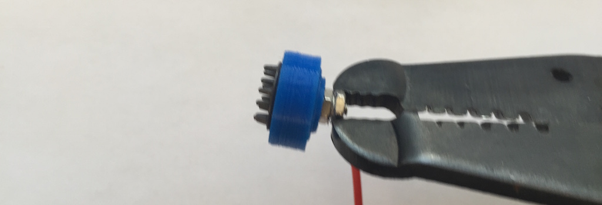

Slip the SPRING_CASING around the wire, as shown below:
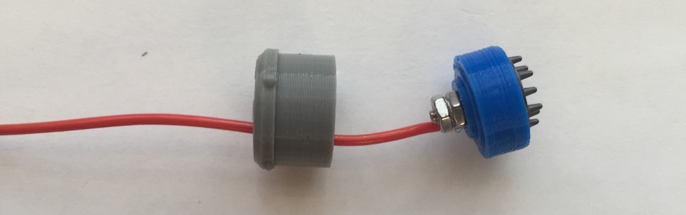

Put a thin line of super glue on the outer edge of the top of the ELECTRODE_HOLDER.
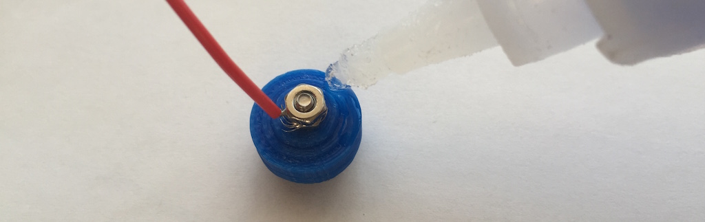

Press the SPRING_CASING against the ELECTRODE_HOLDER and hold for a few seconds to make sure the two pieces are securely connected.
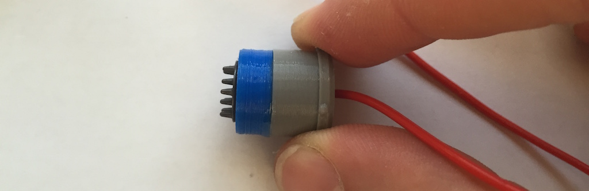

Now sand around the seam between the ELECTRODE_HOLDER and SPRING_CASING. Try your best to make the full cylinder as smooth as possible. Take your time ensuring that the cylinder is as smooth as you can make it, since this will You don't want it to catch on the inside of the OCTABOLT.

Slide a **Suggested Spring 1 (aka "Weak Spring")** and then the OCTABOLT around the wire as shown below.
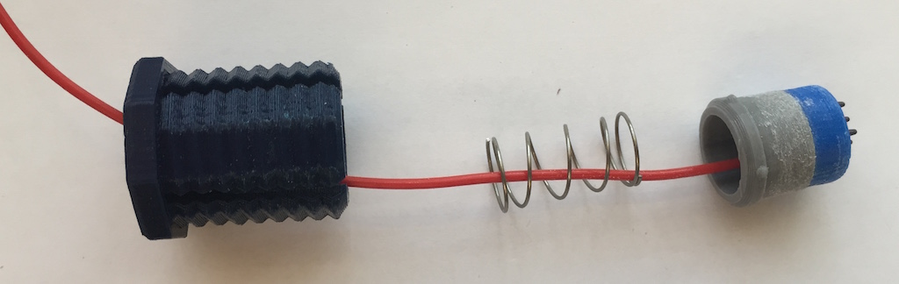

Snap the full electrode unit together, guiding the semi-spherical protrusions on the outside of the SPRING_CASING into the relief cuts of the OCTABOLT. 
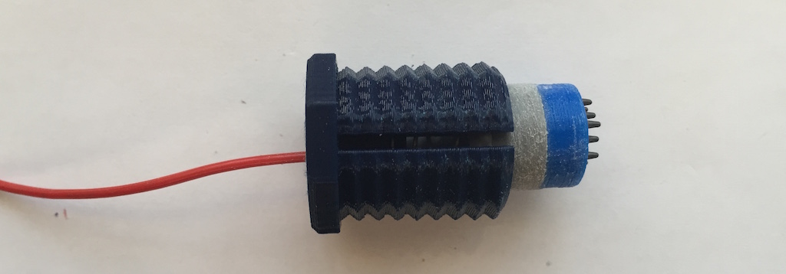

Voila! Spring-loaded electrode GIF!

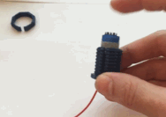

### Insert electrode units into your Ultracortex

Once you've asesembled all of your electrode units, twist them into their respective Ultracortex frame nodes. If the parts are tough to twist into place by hand, use the OCTATOOL that comes with your kit as shown in the picture below. Over time the resistance between the OCTANUT and OCTABOLT will diminish, and the pieces will twist into place more easily.

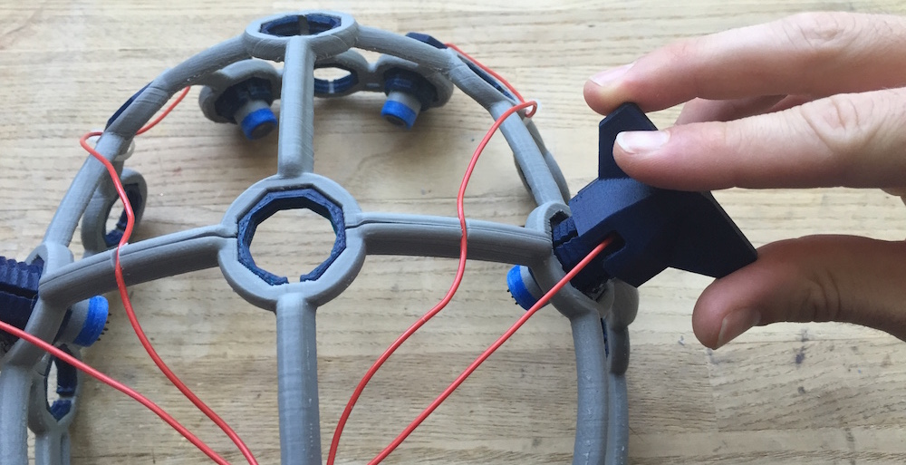

### Reconnect wires to OpenBCI & connect ear clip electrodes (Reference & Ground)

Now that all of your electrode units are connected to your Ultracortex frame, reconnect the electrode wires to the OpenBCI board as detailed above. If you have some handy, you may want to use zip ties to secure the loose wiring to the Ultracortex frame. Later revisions of the headset will be designed to account for this. ;)

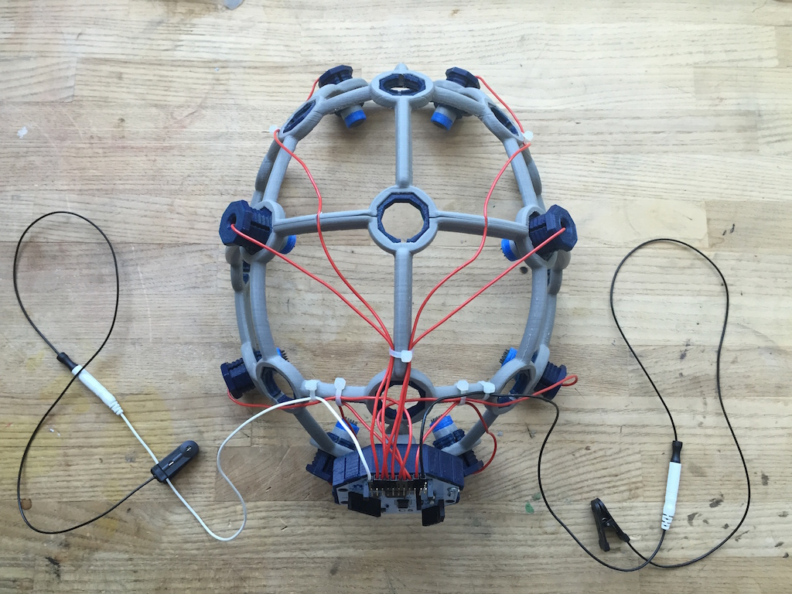

Next, connect two touch-proof adapter cables to SRB2 and bottom BIAS pin (white and black respectively in the image below). You can use the touch-proof adapter that comes with the OpenBCI 32bit Board or OpenBCI 16-channel R&D Kit. Then connect your [ear clip electrodes](http://fri-fl-shop.com/product/td-430-silver-disc-electrode-ear-clip/) to these touch-proof adapters. These ear clip electrodes serve as the reference and bias (ground with common-mode noise rejection) for your EEG system.

### Fasten the BOARD_COVER

Now clip your board cover into place. If you've soldered any of the header rows onto your OpenBCI board, you'll need to use the BOARD_COVER_ADVANCED, as seen in the picture below. Otherwise, you can use the BOARD_COVER_STANDARD with the OpenBCI logo.

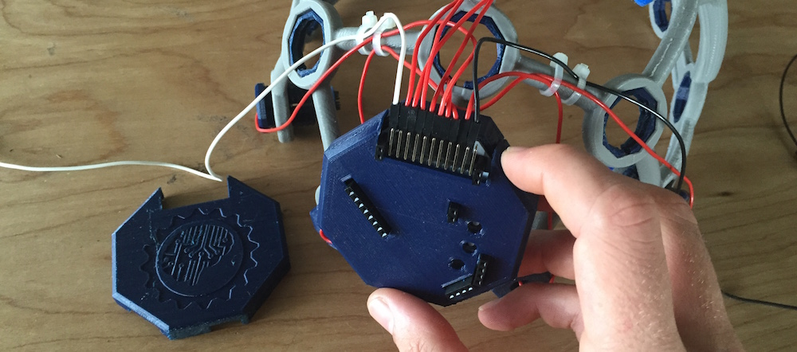

### Adjust the Ultracortex for your head

Put the Ultracortex Mark 3 onto your head and gradually tighten the electrode units until the electrodes are snuggly (but comfortably) against your scalp. If it is difficult to twist the OCTABOLT pieces by hand, you may need to use the OCTATOOL as seen in the gif below. 

**Be careful** not to strain the electrode wires when twisting the electrode unit with the OCTATOOL, or you may separate the wire from the electrode itself. Turn the OCTABOLT until the wire is nearly taught, then reposition the wire and tool and twist again, as demonstrated in the gif.

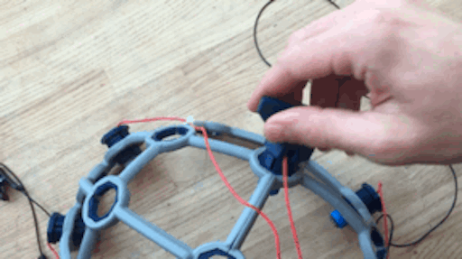

### Improve Comfort!

To make the headset substantially more comfortable, assemble a few Electrode Units without a "spikey" electrode or any of the cabling as shown in the picture below. For this, **use the Suggested Spring 2 (aka "Strong Spring").**

Then insert these spring-loaded standoffs along the midline of the headset and at other locations of your choosing (as indicated by the green circles in the image below). This will redistribute the weight of the headset, relieving the majority of the pressure at the "spikey" electrode locations.

### Examine your brain waves!

Place your UltraCortex on your head so that the back center node is roughly the same distance above your inion (bump on the back of your skull) as the front center node is above the bridge of your nose. As you place the UltraCortex on your head, the springs should adjust to the shape and size of your head. If they get stuck, remove the nodes and sand them down further so that they smoothly adjust to your head size.

Now that you have your Ultracortex assembled and comfortably adjusted to your head size and shape, it's brain wave time!

Check out the [Getting Started w/ OpenBCI tutorial](http://docs.openbci.com/tutorials/01-GettingStarted) to get up-and-running with the [OpenBCI Processing GUI](https://github.com/OpenBCI/OpenBCI_Processing).

Below is a screenshot of what the GUI looks like when you've got your OpenBCI + Ultracortex (w/ 8 channels) hooked up! You can see a nice alpha (~11 hz) spike on the FFT Plot. 

### Give Us Feedback!

If you have questions, comments, or suggestions regarding the printing and/or assembly of the Ultracortex, we'd love to hear from you. Please submit issues to this repository or email us at [contact@openbci.com](mailto:contact@openbci.com). Or take some pictures of yourself wearing the Ultracortex and Tweet at us ([@OpenBCI](https://twitter.com/OpenBCI) & [@Ultracortex](https://twitter.com/Ultracortex))!

