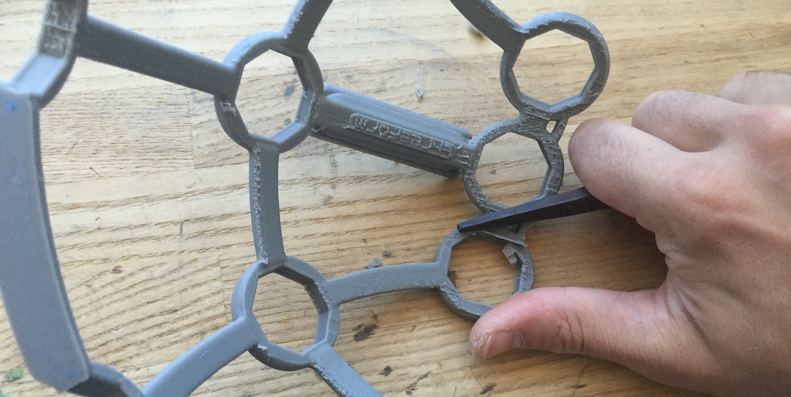
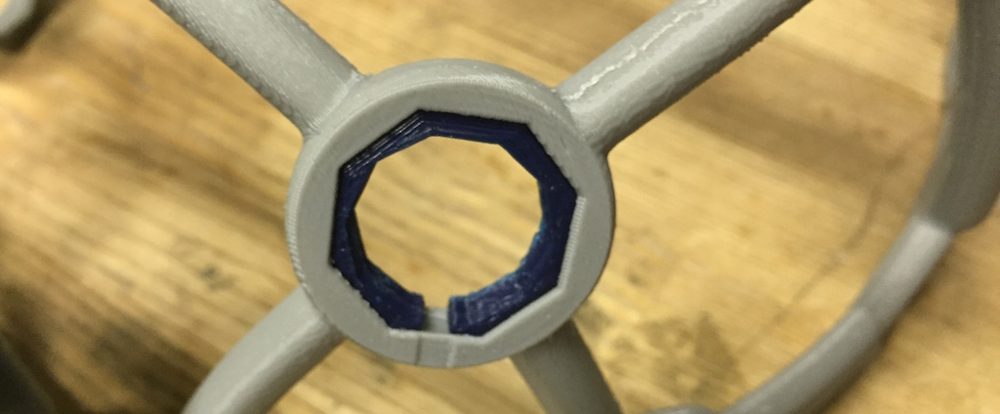
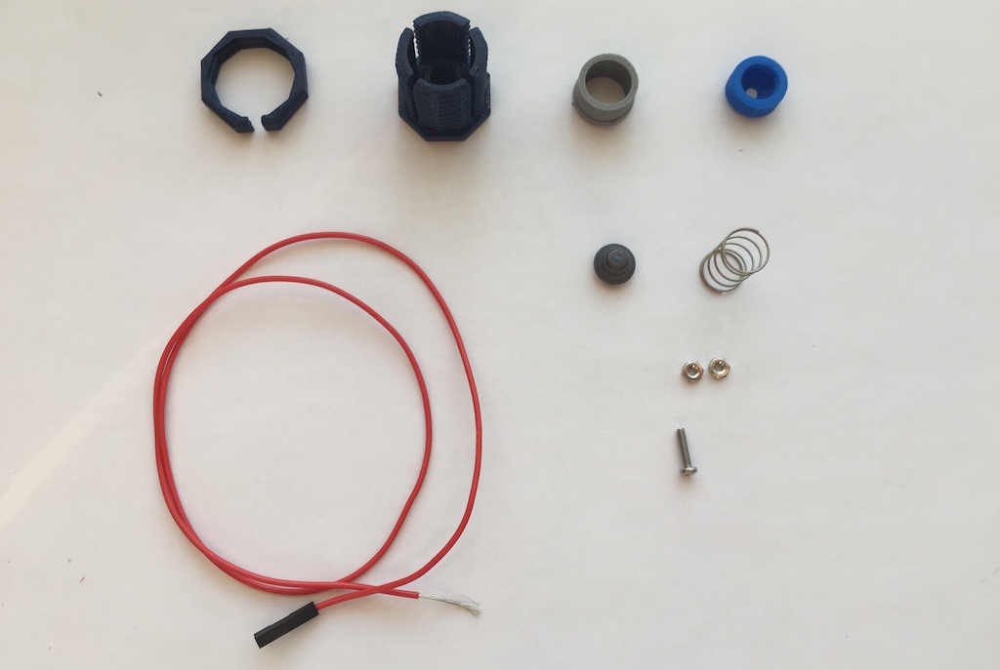

# Ultracortex (Mark 3) Assembly Guide

### Parts & Tools

### Remove residual support material & print flaws

### Glue the FRAME together

### Mount the OpenBCI BOARD_HOLDER

### Insert OCTANUT pieces (x21) into frame

### Identify electrode locations

### Assemble electrode mounts (x8 or x16)
**Note:** repeat this step as many times as necessary, depending upon your OpenBCI setup. You may want to make additional electrode  and keep them 

### Insert electrode mounts into headset

### Embed OpenBCI into the Ultracortex

### Connect electrodes to OpenBCI

### Fasten the BOARD_COVER

### Adjust the Ultracortex for your head

### Examine your brain waves!

