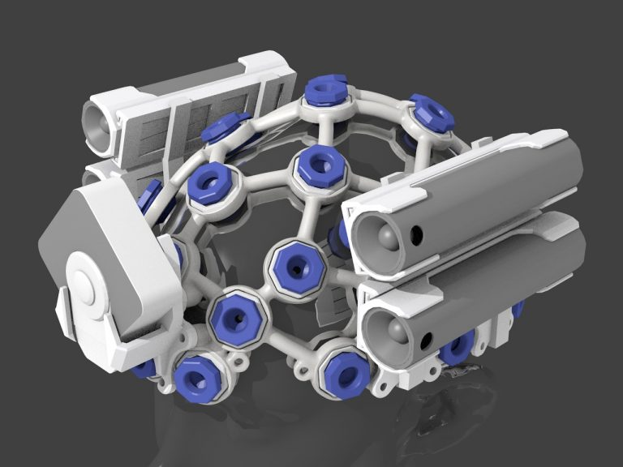
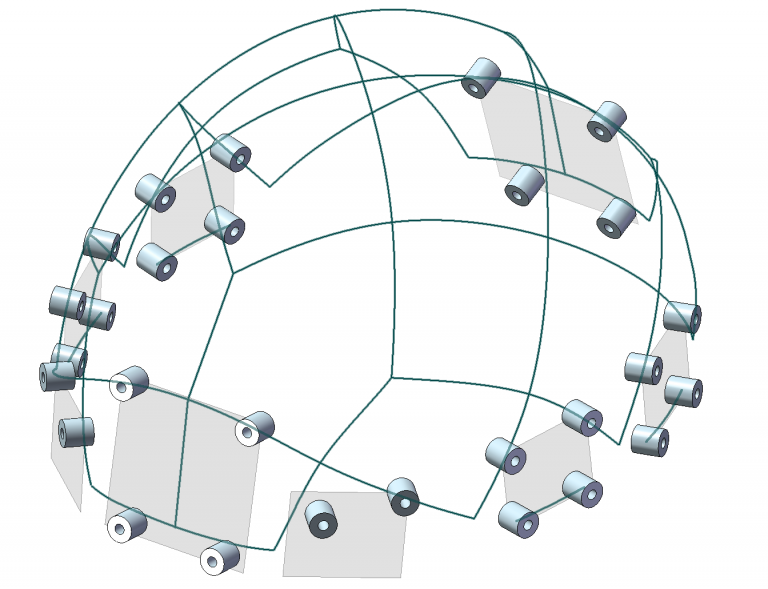
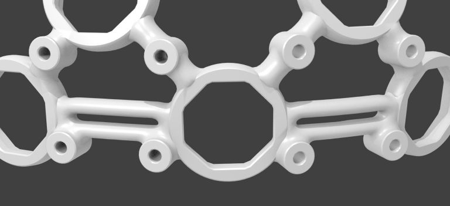

# Ultracortex Mark IV Development Kit, Version 0.5

Download [this archive](https://www.dropbox.com/s/7g9to9lef9cjcmc/OpenBCI%20Ultracortex%20M4_Dev%20Kit_ver0.5.zip?dl=0) to work with the Dev Kit. You can browse through the DevKit files here, but downloading STL parts using the "right-click, Save-as" function **does not work** in Github, it only downloads an HTML to view the 3D part. To download a part from GitHub, you must click the name to go to the preview page, then "right-click, save-as" on the "Download" button. 
In [this blog post](https://openbci.com/community/m4-accessory-mounting-system/), you can read about some of the additional features available in the Ultracortex Mark IV Dev Kit.

## Introduction

This collection of files represents an expanded selection of parts and accessories for the Ultracortex M4. It includes the M4 headset in five sizes, the components used to generate the headsets, the electrode mounting hardware, and OpenBCI board case. Most files are in STL format. When possible solid models have been provided in STEP format. 3D curves (for the headset frame) are provided in IGES format.

## The M4 headset
 
The overall shape of the M4 is based on an average of many heads to create a general fit. The headset frame is offset from the average to hold the electrode nodes above the scalp. The offset is varied to create different sizes. Fine adjustment for head shape is made using adjustment bolts ("Octabolts") with spring-loaded electrodes. The "comfort" bolts with soft feet distribute pressure around the head. The OpenBCI board is mounted on the back, and the result is a wireless, portable, dry-electrode EEG system that can quickly be taken on and off or adjusted for different users.

## Contents

The medium size frame Consists of a 7mm x 9mm elliptical frame offset 18mm from the Meta Dome surface. An Octabolt assembly at 50% of it's ~25mm adjustment range will place the electrode on that surface with the spring compressed 50% (approx. 9mm). The small and large headset are offset 10mm inward and 10mm outward. This creates full coverage for the adjustement ranges. For example, adjusting a bolt all the way outward in the medium frame brings it to the same offset as that bolt adjusted all the way inward on the large headset. There is extra margin in the thread range, and the spring add additional margin. In this kit we have also provide intermediate sizes between the other sizes (-5mm Medium/Small and +5mm Medium/Large), so that heads with unusual proportions are better accomodated.

