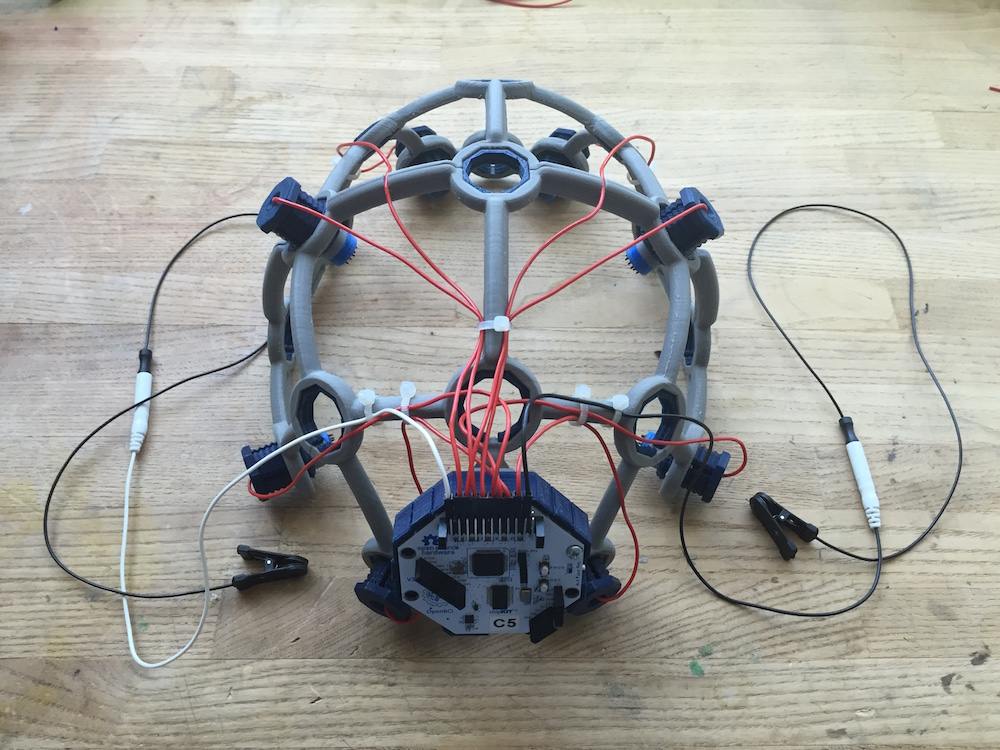

# Ultracortex

Ultracortex Mark Numbers (aka versions)

* [Mark 1](https://github.com/OpenBCI/Ultracortex/tree/master/Mark_1) - designed, printed, assembled, & modeled (April 2015)
* [Mark 2](https://github.com/OpenBCI/Ultracortex/tree/master/Mark_2) - designed, printed, assembled, & tested (May-June 2015)
* [Mark 3](https://github.com/OpenBCI/Ultracortex/tree/master/Mark_3) - designed, printed, assembled, & tested (July-September 2015)
* [Mark III "Nova" & "Supernova"](https://github.com/OpenBCI/Ultracortex/tree/master/Mark_III_Nova) - designed, printed, assembled, & tested (April 2016)
* [Mark III "Nova" & "Supernova" (REVISED)](https://github.com/OpenBCI/Ultracortex/tree/master/Mark_III_Nova_REVISED) - designed, printed, assembled, & tested (June 2016)
* [**CURRENT**] [Mark IV](https://github.com/OpenBCI/Ultracortex/tree/master/Mark_IV) - designed, printed, assembled, & tested (January 2017)

The Ultracortex is an open-source, 3D-printable headset intended to work with the [OpenBCI system](http://openbci.com/). It is capable of recording research-grade brain activity (EEG), muscle activity (EMG), and heart activity (ECG). The Ultracortex is under constant iteration. If you print/assemble your own Ultracortex, we would love to hear your feedback. Send us an email at [contact@openbci.com](mailto:contact@openbci.com) or Tweet at us ([@Ultracortex](https://twitter.com/Ultracortex) & [@OpenBCI](https://twitter.com/OpenBCI))!

Designers & Engineers:

* [Aaron Trocola (aka Threeform)](http://threeformfashion.com/)
* [Conor Russomanno](https://twitter.com/russomanno15)
* [Joel Murphy (aka SafeForRobots)](https://twitter.com/safeforrobots)
* [Aaron Lehr](http://aaronlehr.com/portfolio/)

